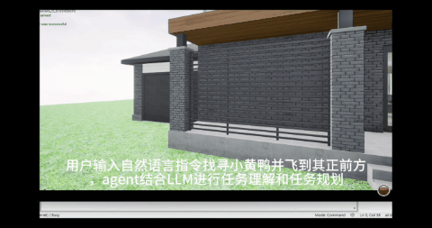

# my_uav_agent

> **理解智能无人系统整体架构，探索未来研究方向。**

## 项目简介

`my_uav_agent` 是一个围绕**智能无人系统（Intelligent Unmanned Systems）**开展学习与实验的个人项目。

建立这个仓库的目的，并不是实现一个完整的无人机 Agent，而是希望通过不断实践，逐步理解一个智能无人系统的整体架构，并在学习过程中寻找值得深入研究的科研方向。

目前项目主要基于 **Microsoft AirSim** 仿真平台开展实验，从无人机基础控制出发，逐步引入大语言模型（LLM）、视觉感知（Vision）以及 Agent 等技术，探索它们在无人系统中的作用，以及这些模块之间如何协同工作。

这个仓库不仅记录代码实现，也记录自己的学习过程、实验结果以及对无人系统的思考。

---

# 为什么建立这个仓库？

随着大语言模型和 Agent 技术的发展，越来越多的研究开始尝试将它们应用到机器人和无人系统中。

然而，在学习过程中我发现，理解某一个模型或算法，并不意味着真正理解一个智能无人系统。

一个能够自主完成任务的无人机，通常需要多个模块共同协作，例如：

* 飞行控制
* 状态获取
* 环境感知
* 任务理解
* 路径规划
* 决策推理
* 动作执行
* 环境反馈

这些模块共同构成了完整的无人系统架构。

因此，我希望借助 AirSim 仿真平台，从基础控制开始，一步一步理解整个系统，而不仅仅关注某一个算法或模型。

---

# 当前学习路线

目前整个项目按照能力逐步增加的方式推进：

```text
AirSim
   │
   ▼
基础控制
   │
   ▼
Prompt + LLM
   │
   ▼
视觉感知
   │
   ▼
Agent
```

每一步都建立在前一阶段的基础上，希望逐渐理解智能无人系统是如何从底层控制发展到高层智能决策的。

---

# 仓库结构

```text
my_uav_agent/
│
├── demo/
│   实验演示视频与图片
│
├── docs/
│   学习笔记、技术总结与阅读记录
│
├── experiments/
│   实验记录与分析
│
├── my_airsim_basic/
│   AirSim 基础控制实验
│
├── my_airsim_Prompt/
│   基于 Prompt 与 LLM 的无人机控制实验
│
├── my_airsim_Vision/
│   无人机视觉感知实验
│
└── my_airsim_Agent/
    基于 Agent 的无人机任务执行实验
```

---

# 当前工作

## AirSim 基础控制

首先学习 AirSim 提供的 Python API，理解无人机最基本的控制方式，包括：

* 起飞与降落
* 位姿获取
* 速度控制
* Waypoint 飞行
* 无人机状态获取

这一阶段的目标是理解无人机控制接口，为后续实验打下基础。

---

## Prompt + LLM

尝试利用自然语言控制无人机。

基本流程如下：

```text
自然语言
    │
    ▼
大语言模型（LLM）
    │
    ▼
飞行指令
    │
    ▼
AirSim API
```

这一阶段关注的不仅是 Prompt Engineering，更希望理解：

**大语言模型在无人系统中究竟应该承担什么角色？**

---

## Vision

在具备基础控制能力之后，引入视觉信息。

目前主要探索：

* AirSim 相机数据获取
* 图像处理
* 场景观察
* 视觉信息在任务执行中的作用

希望让无人机不仅能够执行指令，还能够感知周围环境。

---

## Agent

进一步将语言模型与视觉感知结合，构建简单的 UAV Agent。

目前主要关注：

```text
任务输入
    │
    ▼
推理
    │
    ▼
工具调用
    │
    ▼
无人机执行
```

相比于执行单条控制指令，更关注 Agent 如何完成一个完整任务，以及推理、规划和执行之间的关系。

---

# 学习过程中关注的问题

通过这些实验，我希望逐步回答一些更加基础的问题：

* 一个完整的智能无人系统由哪些模块组成？
* 大语言模型在整个系统中的位置是什么？
* 视觉信息如何参与智能决策？
* Agent 如何将高层任务转化为无人机能够执行的动作？
* 各个模块之间是如何协同工作的？

相比于简单实现一个 Demo，我更希望理解这些问题背后的系统架构。

---

# 当前的研究思考

随着学习的不断深入，我越来越意识到，一个智能 Agent 是否真正具备自主能力，很大程度上取决于它是否能够理解自己所处的环境。

目前仓库主要围绕 AirSim、LLM、Vision 和 Agent 展开学习，希望先建立起对智能无人系统整体架构的认识。

未来，希望能够结合课题组在**三维重建（3D Reconstruction）**方向的研究基础，进一步理解三维环境表示在智能无人系统中的作用。

我认为，三维重建不仅能够恢复真实场景的几何信息，更有可能成为**世界模型（World Model）**的重要底层表示。

世界模型能够帮助智能体持续理解环境，为感知、推理、规划以及自主决策提供统一的空间基础。

因此，希望在理解无人系统整体架构的基础上，进一步探索世界模型在智能无人系统中的应用。

---

# 项目目标

这个仓库更像是一份持续更新的学习记录。

希望通过不断学习和实践，逐步建立起自己对智能无人系统的整体认识，并形成如下学习路径：

```text
AirSim
    │
    ▼
无人机基础控制
    │
    ▼
视觉感知
    │
    ▼
大语言模型
    │
    ▼
Agent
    │
    ▼
世界模型
    │
    ▼
智能无人系统
```

最终，希望能够回答一个自己最感兴趣的问题：

> **如何让智能无人系统不仅能够执行任务，而且能够真正理解环境，并自主完成复杂任务？**

---

# 🎥 演示视频：


# 致谢

本仓库主要用于个人学习、实验与科研探索。

部分实验参考了 AirSim 及相关开源项目，在理解其原理的基础上进行了复现与实践。随着学习的深入，仓库内容也将持续更新和完善。


